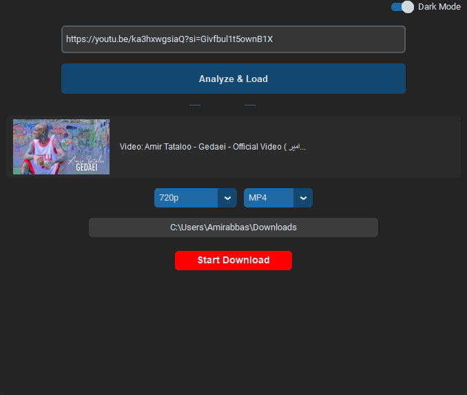

# 🎥 AmuTube Pro
**A Modern, Fast, and Reliable YouTube Downloader with a Sleek GUI**



AmuTube is a desktop application built with Python that allows users to easily download YouTube videos and entire playlists. It features a clean, modern interface and provides various format and quality options.

---

## ✨ Key Features
- 📥 **Playlist Support:** Load full playlists and selectively choose which videos to download.
- 🎞️ **Multiple Formats:** Download as Video (MP4, MKV) or extract Audio (MP3).
- ⚙️ **Quality Control:** Choose resolutions ranging from 360p up to 1080p (Full HD).
- 🎨 **Modern UI:** Built using `CustomTkinter` with native Dark/Light mode support.
- 🚀 **Standalone Executable:** Portable EXE version available (no Python installation required).
- 🛠️ **Smart Sanitization:** Automatically cleans video titles to prevent file system errors.

## 🛠️ Tech Stack
- **Language:** Python 3.x
- **Core Engine:** [yt-dlp](https://github.com/yt-dlp/yt-dlp)
- **GUI Library:** [CustomTkinter](https://github.com/TomSchimansky/CustomTkinter)
- **Media Processing:** [FFmpeg](https://ffmpeg.org/)

## 🚀 Installation & Usage
To run the source code locally, follow these steps:

1. **Clone the repository:**
   ```bash
   git clone [https://github.com/AmuAmirabbas/AmuTube.git](https://github.com/AmuAmirabbas/AmuTube.git)
Install dependencies:

Bash
pip install requirements.txt
FFmpeg Setup:
Ensure the ffmpeg folder (containing the binaries) is placed in the root directory of the project.

Run the app:

Bash
python main.py
📦 Building the EXE
To generate a standalone executable, the following PyInstaller command was used:

Bash
pyinstaller --noconsole --onefile --name "AmuTube" --icon="icon.ico" --add-data "ffmpeg;ffmpeg" --add-data "icon.ico;." main.py
⚖️ License
This project is open-source and intended for personal and educational use. Please respect YouTube's Terms of Service.

Developed with ❤️ by AmuAmirabbas


---